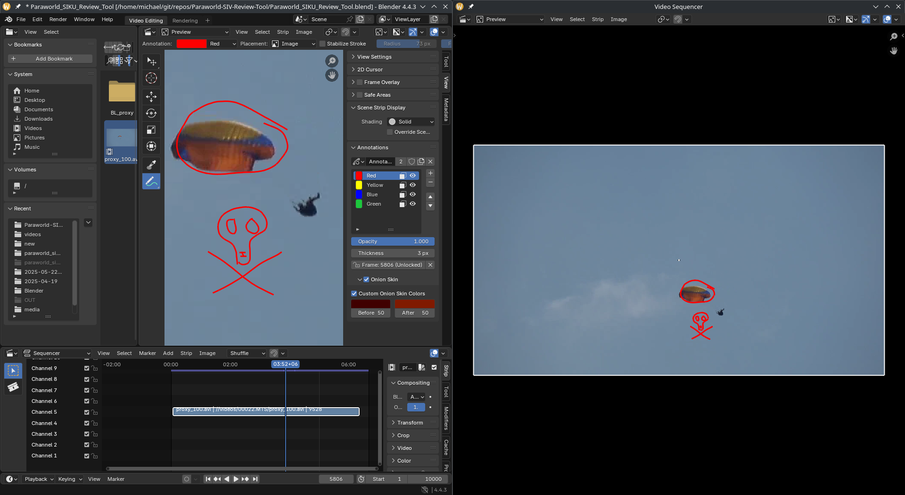
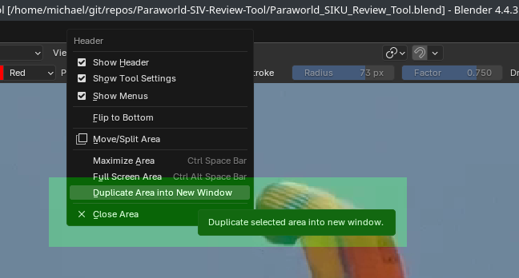
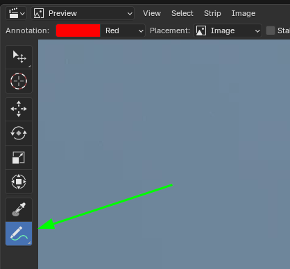
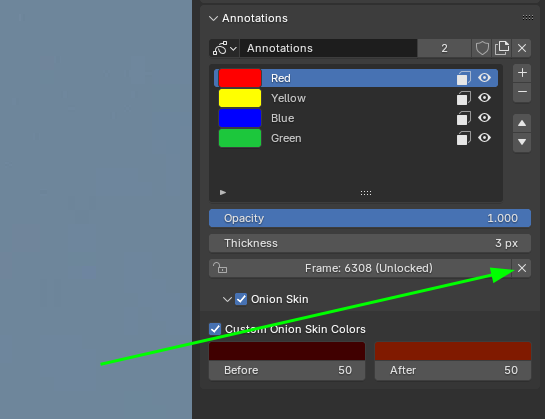
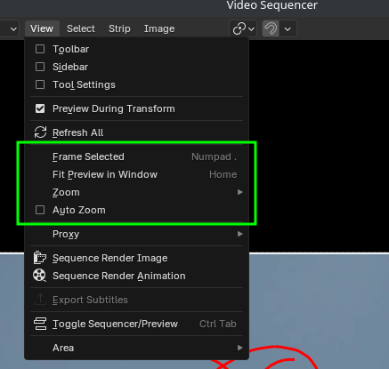

# Paraworld Siku Review Tool

A Blender file with a layout suited to review 
[Paraworld](https://www.paraworld.ch/) Paragliding SIV
videos on two monitors.

## Setup Tips

### Duplicate Area into New Window

In order to be able to annotate two (or more) Video Preview Windows at the 
same time, Blender can duplicate (two windows of the same instance) areas.

## Usage Tips

### Annotate

#### Draw

Make sure the "Draw" tool is selected:

#### Remove

##### Erase

Erase: Press `D` and `Right Mouse Click` to remove the annotation.

##### Delete

With the color of the annotation (which you want to delete) selected, click the `x` icon
and delete the annotation(s).

### View

- Fill video to view: `Home`
- Autozoom to always fill the the available window space

### Blender Version

- [4.4.3](https://www.blender.org/download/)
